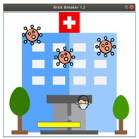
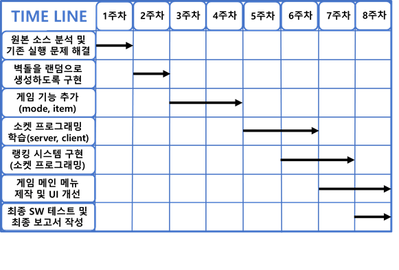

# 2020-1-OSSP2-spotlight-2
Team spotlight

원본 소스 : https://github.com/tylucaskelley/brick-breaker

[OSSP]김관우 박계원 윤기범

동국대학교 컴퓨터공학전공 공개 SW 프로젝트진행 중  
벽돌깨기 오픈 소스를 이용해 개선점을 파악하고 이를 개선하며 새로운 기능을 추가한다.  

## 1. 개발환경

 - 운영체제 : Linux(ubuntu)  
 - 통합 계발 환경 : Eclipse  
 - 개발 언어 : JAVA  
 - 데이터베이스 MySQL  

## 2. 패치 내역

 - 하단 바의 움직임 개선  
 - 벽돌 랜덤 생성 구현  
 - 베이직 모드, 하드 모드 추가  
 - 아이템 추가  
 - 랭킹 시스템 서버 구현  
 - UI 개선 및 메인 메뉴 제작  

## 3. 코드 업데이트 일지

# 1주차 진행 사항  
 + 원래 한 칸씩 끊겨서 이동하던 하단 바의 움직임을   
   키를 한번만 누르면 지속적으로 이동하도록 수정   
# 2주차 진행 사항  
 + 스테이지에 반복적으로 고정된 위치에 생성되는 벽돌 시스템을 없애고  
   랜덤한 위치에 벽돌이 생성되도록 수정  
# 3주차 진행 사항   
 + 공의 속도 증가 및 감소 아이템 추가  
 + 하단 바 좌우 조작을 반전시키는 리버스 아이템 구현  
   리버스 아이템을 먹을 시 하단 바의 색상이 변경됨  
# 4주차 진행 사항  
 + 게임 모드 추가를 위해 모드 선택 창 추가(베이직 / 하드)  
 + 하드 모드 추가 구현 완료  
> 하드 모드는 기존의 두 방향키( <- , -> )를 사용하는 베이직 모드와는 달리    
> 하단 바의 좌우 조작키가 사용자가 누를 때 마다 랜덤한 알파벳 키로 변경  
> 게임 화면 좌우에 변경되는 조작 키 출력  
> 난이도를 고려해 하드모드에서는 리버스 아이템 제거  

## 4. 게임 아이템 추가
- 녹색 아이템 획득 : 하단 바 길이 증가
- 붉은색 아이템 획득 : 하단 바 길이 감소
- 파란색 아이템 획득 : 공 속도 증가(1회)
- 분홍색 아이템 획득 : 공 속도 감소(1회)
- 노란색 아이템 획득 : 좌우 키 반전(paddle의 색상 RED)

## 5. GameTheme(게임 테마)

- 코로나가 만연한 지금! 의사가 되어 Covid-19를 격퇴하라!
- 랜덤으로 생성되는 코로나 바이러스를 Paddle을 조작하여 마스크 쓴 사람들 통해 제거하라!
- 여러 아이템들은 당신을 도울수도 혹은 곤경에 빠뜨릴수도 항상 신중하라!!
- 당신에게 주어진 기회는 단 다섯번뿐!!!
- 당신의 기록을 저장하고 자랑할수 있는 랭킹 시스템 까지!!!
- 과연 당신이 1등이 되고 최고 점수를 획득할 수 있을까??

## 5. 타임라인

