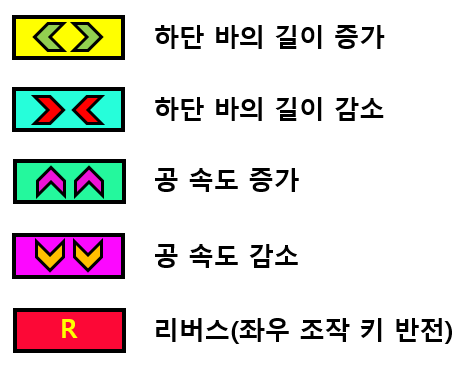
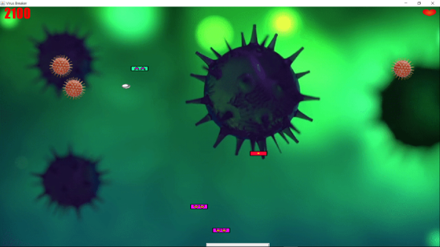

2020-1-OSSP2-spotlight-2
Team spotlight

원본 소스 : https://github.com/tylucaskelley/brick-breaker

[OSSP]김관우 박계원 윤기범

동국대학교 컴퓨터공학전공 공개 SW 프로젝트진행 중  
벽돌깨기 오픈 소스를 이용해 개선점을 파악하고 이를 개선하며 새로운 기능을 추가한다.  

## 1. 개발환경

 - 운영체제 : Linux(ubuntu)  
 - 통합 계발 환경 : Eclipse  
 - 개발 언어 : JAVA  
 - 데이터베이스 AWS_RDS, MySQL  
 - 웹 서비스 : AWS
 
## 2. 패치 내역

 - 하단 바의 움직임 개선  
 - 벽돌 랜덤 생성 구현  
 - 베이직 모드, 하드 모드 추가  
 - 아이템 추가  
 - 랭킹 시스템 서버 구현  
 - UI 개선 및 메인 메뉴 제작 
 - 회원가입 및 로그인 시스템 구현

## 3. 코드 업데이트 일지

### 1주차 진행 사항  
 - [X] 원래 한 칸씩 끊겨서 이동하던 하단 바의 움직임을   
   키를 한번만 누르면 지속적으로 이동하도록 수정   
### 2주차 진행 사항  
 - [X] 스테이지에 반복적으로 고정된 위치에 생성되는 벽돌 시스템을 없애고  
   랜덤한 위치에 벽돌이 생성되도록 수정  
### 3주차 진행 사항   
 - [X] 공의 속도 증가 및 감소 아이템 추가  
 - [X] 하단 바 좌우 조작을 반전시키는 리버스 아이템 구현  
   리버스 아이템을 먹을 시 하단 바의 색상이 변경됨  
### 4주차 진행 사항  
 - [X] 게임 모드 추가를 위해 모드 선택 창 추가(베이직 / 하드)  
 - [X] 하드 모드 추가 구현 완료  
  하드 모드는 기존의 두 방향키( <- , -> )를 사용하는 베이직 모드와는 달리    
  하단 바의 좌우 조작키가 사용자가 누를 때 마다 랜덤한 알파벳 키로 변경  
  게임 화면 좌우에 변경되는 조작 키 출력  
  난이도를 고려해 하드모드에서는 리버스 아이템 제거    

### 5주차 진행 사항
 - [X] 동적 창 구현을 위해 생성된 객체 크기 조절
 - [X] UI개선을 위해 아이템 및 벽돌 이미지 추가
 - [X] 백그라운드 이미지의 크기 조절
 - [X] 게임 사운드 추가 및 수정

### 6주차 진행 사항
 - [X] Life이미지 및 Ready화면 이미지 추가
 - [X] 하드모드 좌우 하단 알파벳 이미지 추가
 - [X] AWS 서버 생성 및 서버 코드 작성

### 7주차 진행 사항
 - [X] 회원가입 및 로그인 시스템 구현 완료
       (서버와 클라이언트 연결)
 - [X] 메인페이지 및 메뉴 생성
 - [X] 게임 사운드 수정

### 8주차 진행사항
 - [X] 랭킹 시스템 구현
 - [X] 패스워드 암호화 적용

## 4. 게임 아이템 추가

## 5. GameTheme(게임 테마)

- 코로나가 만연한 지금! Covid-19를 격퇴하라!
- 랜덤으로 생성되는 코로나 바이러스를 Paddle을 조작하여 제거하라!
- 여러 아이템들은 당신을 도울수도 혹은 곤경에 빠뜨릴수도 항상 신중하라!!
- 당신에게 주어진 기회는 단 한번뿐!!!
- 당신의 기록을 저장하고 자랑할수 있는 랭킹 시스템 까지!!!
- 과연 당신이 1등이 되고 최고 점수를 획득할 수 있을까??

## 6. 타임라인

## 7. 이미지 및 음원 출처
- Virus 이미지 : https://pixabay.com/ko/illustrations/%EB%B0%94%EC%9D%B4%EB%9F%AC%EC%8A%A4-%EC%99%B8%EB%94%B4-%EC%BD%94%EB%A1%9C%EB%82%98-%EC%A0%84%EC%97%BC%EB%B3%91-4930122/

- Background 영상 : https://pixabay.com/ko/videos/%EB%B0%94%EC%9D%B4%EB%9F%AC%EC%8A%A4-%EC%BD%94%EB%A1%9C%EB%82%98-%EC%84%B8%EA%B3%84%EC%A0%81-%EC%9C%A0%ED%96%89%EB%B3%91-33131/

- Ball 이미지: https://pixabay.com/ko/vectors/공-강철-은화-라운드-149921/

- Background Sound 및 효과음 : https://www.youtube.com/audiolibrary/soundeffects?ar=1590045019076&nv=1

- Mainmenu Background 이미지 : https://pixabay.com/ko/illustrations/%EC%A7%80%EA%B5%AC-%EC%BD%94%EB%A1%9C%EB%82%98-%EB%B0%94%EC%9D%B4%EB%9F%AC%EC%8A%A4-%EA%B8%80%EB%A1%9C%EB%B8%8C-5138795/

- 이외의 이미지 : 직접 구현

## 8. 실행 방법

- 해당 프로젝트를 clone해 사용자의 linux에 다운 받는다.
- 프로젝트 내의 brick-breaker-master폴더를 eclipse에서 File/Open Projects from File System.. 으로 오픈한다.
- aws 서버의 고정 ip 주소를 할당 받지 않아 실행을 원하면 kw2577@naver.com 으로 서버의 ip 주소를 요청한다.
- 제공 받은 ip 주소를 이용해 Client.java 파일의 20번째 줄에서 서버의 ip 주소를 변경한다.
- 컴파일 후 프로그램을 실행한다.

